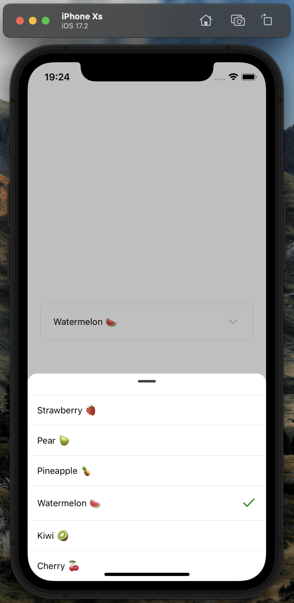

# React Native Bottom Sheet Input Select

Este projeto contém um exemplo de um componente de input select desenvolvido com o uso de React Native Bottom Sheet, projetado para oferecer uma experiência de seleção fluida e customizável em aplicativos móveis.

## 🚀 Tecnologias Utilizadas

- **React Native Bottom Sheet**: Biblioteca para criação da bottom sheet com gestos e animações.
- **React Native Gesture Handler**: Para manipulação de gestos, garantindo uma experiência fluida e responsiva.
- **TypeScript**: Tipagem estática para melhor manutenção e escalabilidade do código.

## 📸 Capturas de Tela
